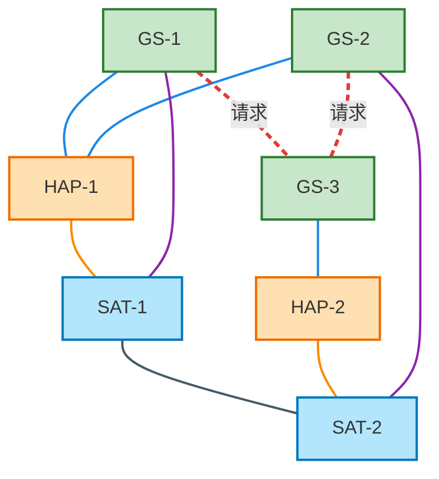
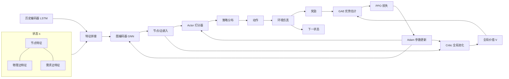

# QKD三层FSO网络强化学习算法介绍（Graph-MAPPO）

> 本文档只描述**算法本身**：问题建模、输入特征、编码方式、动作与价值、奖励、训练与参数更新，全部用数学公式表达，不涉及任何代码实现。所有定义与 `Research/qkd_rl` 当前代码保持一致，术语的唯一来源见 [[QKD三层FSO网络强化学习代码架构设计-精简版]]。

## 1. 问题建模：带图结构的马尔可夫决策过程

### 1.1 场景

三层 FSO 量子密钥分发网络由三类节点构成：地面站（GS）、高空平台（HAP）、卫星（SAT）。任意两层之间以及同层内部存在候选物理链路（GS-HAP、GS-SAT、HAP-SAT、SAT-SAT），每条链路按分钟生成密钥（QKP），生成的密钥可以在链路密钥池中暂存。地面站之间以分钟粒度随机到达通信密钥需求请求，请求有截止时间与优先级。

在每个时隙 $t$（1 分钟），智能体观察全局网络状态，为每个节点决定是否激活某条候选链路（或保持空闲），链路激活后按该时隙速率生成密钥，生成密钥经路由分配去服务待处理的请求。

### 1.2 MDP 五元组

| 元素 | 定义 |
| --- | --- |
| 状态 $s_t$ | 由**物理图**与**逻辑图**融合成的全局图：节点集合 + 物理链路边 + GS-GS 需求边，以及每个实体携带的特征与历史（见 §3） |
| 动作 $a_t$ | 一个**全局匹配**：从当前合法物理边集合中选出一组互不相交的边（每个节点至多参与一条），未匹配节点保持空闲 |
| 转移 $P(s_{t+1}\mid s_t,a_t)$ | 由链路速率的时间演化（天气、轨道几何）、密钥生成/过期、请求到达/服务/过期决定 |
| 奖励 $r_t$ | 见 §6，奖励函数是服务、实际存入池的生成密钥、失败、等待、溢出、密钥过期、动作冲突的加权组合 |
| 折扣因子 | $\gamma$（默认 $0.99$） |

### 1.3 图的动态性与动作合法性

图随 $t$ **实时更新**：物理图只保留当前合法的链路，逻辑图只保留活跃或近期出现过的请求对。动作掩码在**构图之前**完成——不可用、速率低于下限、被禁用类型的链路直接不出现在任何节点的候选集合中；`idle` 恒合法。因此策略只在合法动作上定义（见 §5.2）。
### 1.4 网络拓扑样例

一个包含三种节点、四种物理链路和 GS-GS 请求链路的示意拓扑（颜色仅用于区分类型）：

| 图元 | 含义 |
| --- | --- |
| 绿色节点 | 地面站 GS |
| 橙色节点 | 高空平台 HAP |
| 蓝色节点 | 卫星 SAT |
| 蓝实线 | 物理链路 GS-HAP |
| 紫实线 | 物理链路 GS-SAT |
| 橙实线 | 物理链路 HAP-SAT |
| 深灰实线 | 物理链路 SAT-SAT |
| 红色虚线 | GS-GS 请求链路（逻辑图，不可被动作选择，只参与 GNN 编码） |

物理图由"三种节点 + 四种物理链路"构成，逻辑图由"地面站之间的请求链路"构成；两者共享同一节点集合，融合为一个全局图。

## 2. 总体架构

算法采用**共享编码器的 Actor-Critic** 结构，属于多智能体 PPO（MAPPO）在单图场景下的等价形式：所有节点共享同一策略参数，Critic 是全局价值函数。

- **编码器**：先由历史编码器（共享 LSTM，可选）把每个实体的历史窗口编码为向量，再与手工特征拼接，最后经图编码器（GNN）消息传递得到每个节点、每条边的嵌入。
- **Actor**：参数在所有边/节点间共享，对每条合法物理边输出一个全局可比的分数，再按这些分数**顺序采样一个匹配**（每步只在两端点仍空闲的边中选一条）；确定性评估时按分数贪心选边。
- **Critic**：对节点嵌入和两类边嵌入分别做全局池化，拼上规模计数，输出全局标量价值 $V(s)$。
- **训练**：环境 rollout 收集轨迹 → GAE 计算优势与回报 → PPO 裁剪目标更新共享参数。

## 3. 输入特征

特征由三部分组成：节点特征、物理边特征、需求边特征，以及可选的每个实体的历史序列编码。

### 3.1 节点特征

节点 $v$ 的静态/动态特征向量记为 $x_v \in \mathbb{R}^{d_n}$：

| 特征 | 含义 |
| --- | --- |
| $\mathrm{onehot}(type_v)$ | 节点类型 GS/HAP/SAT 的 one-hot（3 维） |
| $\mathrm{qkp\_level}_v$ | 节点所有关联链路密钥池总库存 / 总容量 |
| $\mathrm{qkp\_cap\_left}_v$ | 关联链路剩余容量 / 总容量 |
| $\mathrm{demand\_in}_v, \mathrm{demand\_out}_v$ | 以 $v$ 为目的/源的请求密钥量（按量级归一化） |
| $\mathrm{queue\_pressure}_v$ | 以 $v$ 为源或目的、仍在等待服务的请求个数（按计数归一化），衡量节点积压压力 |
| $\mathrm{recent\_demand}_v$ | 历史窗口 $[15,60,240]$ 内到达量，每个窗口一个求和值（3 维） |
| $\mathrm{is\_available}_v$ | 是否存在任一可用相邻链路 |
| $\mathrm{qkp\_utilization}_v$ | 关联链路库存利用率（当前实现与 $\mathrm{qkp\_level}$ 数值相同） |
| 时间周期特征 | 分钟/年中的 $\sin/\cos$ 编码 |

### 3.2 物理边特征（前向时间窗）

物理边 $i=(u,v)$ 的特征记为 $e_i^{p} \in \mathbb{R}^{d_p}$：

| 特征 | 含义 |
| --- | --- |
| $\mathrm{onehot}(type_i)$ | 链路类型 one-hot（4 维） |
| $a_i(t)$ | 当前时隙可用性 |
| $\hat{r}_i(t)$ | 当前归一化速率 |
| $\{r_i(t+\tau)\}_{\tau=1}^{H}$ | 未来 $H=6$ 步归一化速率（前向窗口） |
| $\{a_i(t+\tau)\}_{\tau=1}^{H}$ | 未来 $H$ 步可用性 |
| $\Delta r_i$、$\bar r_i$、$\max r_i$ | 窗口内速率增量/均值/最大值 |
| $\mathrm{last\_activated}_i$ | 上一时隙是否激活 |
| $\mathrm{qkp\_cap\_left}_i$ | 链路剩余 QKP 容量 / 容量（未满则仍可继续生成存储） |

未来速率进入特征的原因：离线数据中未来速率已知，智能体可以据此规划"何时激活、何时让链路休息"。

切换标志不作为独立特征：$\mathrm{last\_activated}$ 已给出上一时隙是否激活，配合本时隙自身的激活决策即可推断是否发生切换；切换时隙生成速率减半的语义仍由环境实现（见精简版文档）。

### 3.3 需求边特征（后向时间窗）

GS-GS 需求边 $j=(p,q)$ 的特征记为 $d_j \in \mathbb{R}^{d_d}$：

| 特征 | 含义 |
| --- | --- |
| $\mathrm{pending\_amount}_j$ | 该请求对 pending 密钥量（归一化） |
| $\mathrm{pending\_count}_j$ | pending 请求数（归一化） |
| $\mathrm{min\_deadline}_j$、$\mathrm{mean\_deadline}_j$ | 剩余截止时间的最小/均值（归一化） |
| $\mathrm{priority\_sum}_j$ | 请求量 × 优先级之和（归一化） |
| $\mathrm{arr/serv/fail}_j^{(w)}$ | 历史窗口 $w \in [15,60,240,1440]$ 内到达/服务/失败量，每窗口一个求和值（各 4 维） |

每个历史窗口 $w$ 各贡献一个聚合值（窗口内该事件的密钥量求和），因此"历史窗口"特征是维度 = 窗口个数的向量：$[15,60,240,1440]$ → 4 维，到达/服务/失败三类合计 12 维。不同窗口代表不同时间尺度，让模型同时感知短期波动与长期趋势；单个标量无法表达这种多尺度信息。

### 3.4 历史编码器（共享 per-entity LSTM，可选）

每个节点、每条物理链路、每条需求链路各自维护长度为 $L$ 的历史序列（冷启动时左侧补零，用有效长度 $l$ 表示）。三类实体的通道数不同，因此先各自用输入投影 $\mathrm{Proj}^{type}$ 统一到隐藏维，再送入**同一套共享 LSTM**：

$$
h_v^{\mathrm{hist}} = \mathrm{LSTM}\big(\mathrm{Proj}^{node}([\,x_v^{(t-L+1)};\dots;x_v^{(t)}\,])\big)_{\text{最后一步}},\quad h_i^{\mathrm{hist}} \text{ 同理}.
$$

- 节点序列通道：当步到达/服务/失败量、关联链路密钥池总量；
- 物理边序列通道：QKP 水平、可用性、激活标志；
- 需求边序列通道：到达/服务/失败量。

设计原则：**LSTM 只编码过去**（未来速率只走前向窗口特征），参数在 actor 与 critic 之间共享，输出为每个实体的向量 $h\in\mathbb{R}^{d_H}$。

### 3.5 特征拼接（进入 GNN 之前）

历史编码器启用后，手工特征与 LSTM 输出拼接（未启用时 $h=\mathbf 0$）：

$$
\tilde x_v = [\,x_v\;;\; h_v^{\mathrm{hist}}\,],\qquad
\tilde e_i = [\,e_i^p \;;\; \mathbf 0 \;;\; h_i^{\mathrm{hist}}\,],\qquad
\tilde d_j = [\,\mathbf 0 \;;\; d_j \;;\; h_j^{\mathrm{hist}}\,].
$$

物理边在需求特征部分补 0、需求边在物理特征部分补 0，统一到同一特征维度 $d_e = d_p + d_d$（未启用历史编码器时为 $d_e=d_p+d_d$）。所有特征在送入网络前按配置做了归一化。

## 4. 图编码器（GNN）

### 4.1 投影

先对拼接后的特征做线性/MLP 投影到隐藏维 $d$：

$$
h_v^{(0)} = \sigma\big(W_n \tilde x_v + b_n\big),\qquad
e_i^{(0)} = \sigma\big(W_e \tilde e_i + b_e\big),
$$

物理边与需求边使用**各自独立的边投影**：虽然两类边特征已统一到同一维度，但语义不同（链路能力 vs 请求压力），投影阶段就不共享变换；投影后仍处于同一 hidden 空间，便于后续统一的消息聚合。

### 4.2 边条件消息传递

设第 $k$ 层的节点嵌入为 $h_v^{(k)}$，边嵌入固定为 $e_i^{(0)}$（只在入口投影一次）。每一层对**两类边分别做消息传递**，因为物理边承载链路能力、需求边承载请求压力，语义标准不同，各用独立的 message MLP $\varphi^p, \varphi^d$：

$$
m_i^{(k)} = \varphi^{type(i)}\Big(\big[\,h_{s(i)}^{(k)}\;;\; e_i^{(0)}\,\big]\Big),
$$

其中 $s(i)$ 是边的起点（有向化后每条无向链路对应两条有向边）。按终点聚合，物理边与需求边**各自按自己的入边邻居数取平均再相加**：

$$
a_v^{(k)} =
\frac{1}{|\mathcal{N}_v^{p}|}\sum_{i\in\mathcal{N}_v^{p}} m_i^{(k)}
\;+\;
\frac{1}{|\mathcal{N}_v^{d}|}\sum_{i\in\mathcal{N}_v^{d}} m_i^{(k)},
$$

$\mathcal{N}_v^{p}$、$\mathcal{N}_v^{d}$ 分别为以 $v$ 为终点的物理边、需求边集合（孤立节点聚合结果为 $\mathbf 0$）。

### 4.3 更新、归一化与残差

$$
\tilde h_v^{(k+1)} = \mathrm{LayerNorm}\Big( U^{(k)}\big(\,[\,h_v^{(k)}\;;\; a_v^{(k)}\,]\,\big) \Big),
\qquad
h_v^{(k+1)} = h_v^{(k)} + \tilde h_v^{(k+1)} \;\text{（残差，可配置）}.
$$

共 $K=3$ 层。输出为节点嵌入矩阵 $H \in \mathbb{R}^{|V|\times d}$ 与边嵌入矩阵 $E \in \mathbb{R}^{|E|\times d}$。由于消息传递同时覆盖物理边与需求边，节点嵌入同时携带"我能从哪里拿到密钥"和"哪里需要密钥"两类信息。

## 5. Actor 与 Critic

### 5.1 Actor：边级打分

所有物理边共享同一打分器。对每条合法物理边 $(u,v)$，分数为

$$
s_{(u,v)} = \mathrm{MLP}^{edge}\big(\,[\,h_u\;;\; h_v\;;\; e_{(u,v)}\,]\,\big),
$$

其中 $h_u,h_v$ 是 GNN 输出的两端节点嵌入，$e_{(u,v)}$ 是对应有向边的边嵌入。打分天然建模了边对两端节点状态与链路能力的联合影响，并且同一条边两端共享同一个分数，因此分数在全图范围内可比。

### 5.2 Mask 与全局匹配策略

mask 在构图前完成：不可用、低速率、禁用类型的链路不进入任何候选，因此打分只发生在合法边上。策略通过**顺序采样**生成一个匹配：

$$
\pi_\theta(\mathcal{M}\mid s_t) = \prod_{k=1}^{|\mathcal{M}|} \frac{\exp\big(s_{e_k}/T\big)}{\sum_{e\in\mathcal{A}_k}\exp\big(s_e/T\big)},
$$

其中 $e_k$ 是第 $k$ 步选中的边，$\mathcal{A}_k$ 是第 $k$ 步两端点仍空闲的合法边集合，$T$ 为温度（默认 $1.0$）。采样时对 $\mathcal{A}_k$ 做 softmax 取一条；确定性评估时取 argmax。联合对数概率为每一步 softmax 对数概率之和，PPO 优化的正是环境实际执行的那个匹配。

### 5.3 Critic：全局价值

Critic 采用分类型全局池化（`typed_mean`）。三类嵌入分别取平均：

$$
g_{\mathrm{node}} = \frac{1}{|V|}\sum_{v\in V} h_v,\qquad
g_{\mathrm{phys}} = \frac{1}{|E_p|}\sum_{i\in E_p} e_i,\qquad
g_{\mathrm{demand}} = \frac{1}{|E_d|}\sum_{j\in E_d} e_j,
$$

拼上压缩后的图规模计数：

$$
g = \Big[\,g_{\mathrm{node}}\;;\; g_{\mathrm{phys}}\;;\; g_{\mathrm{demand}}\;;\;
\log(1+|V|)\;;\; \log(1+|E_p|/2)\;;\; \log(1+|E_d|/2)\,\Big] \in \mathbb{R}^{3d+3},
$$

最终 $V_\psi(s_t) = \mathrm{MLP}^{critic}(g)$。分类型池化避免物理边与需求边在池化时相互稀释，计数项弥补均值池化丢失的图规模信息。由于每个时隙只有**一个**全局价值，所有节点共享同一优势。

## 6. 奖励设计

单步奖励是七个分量的加权组合：

$$
r_t = w_s\,S_t \;+\; w_g\,G_t \;-\; w_f\,F_t \;-\; w_w\,W_t \;-\; w_o\,O_t \;-\; w_e\,E_t \;-\; w_c\,C_t,
$$

| 分量 | 含义 | 默认权重 |
| --- | --- | --- |
| $S_t$ | 本步成功服务的密钥量 | $2.0$ |
| $G_t$ | 实际存入 QKP 池的生成密钥量 $=\min(\text{速率}\times\text{时隙}, \text{池剩余容量})$ | $0.0$ |
| $F_t$ | 失败密钥量（含过期请求） | $2.0$ |
| $W_t$ | 等待中的密钥量（仅本步新增积压） | $0.0$ |
| $O_t$ | 溢出（生成但无法存储）的密钥量 | $0.0$ |
| $E_t$ | 过期密钥量 | $0.1$ |
| $C_t$ | 动作冲突次数 | $0.0$ |

当前权重只保留与服务成功/失败直接相关的项：`served=2.0, generated=0.0, failed=2.0, waiting=0.0, overflow=0.0, expired_key=0.1, conflict=0.0`。原因是实测旧奖励（生成/等待给分）会被"刷"——策略拿到更高奖励却服务更少；奖励只按服务量给分并按到达需求归一化后近似成功率。

生成奖励当前为 $0$，激活一条已满链路不再产生溢出惩罚（$w_o=0$），也不会刷到额外的生成奖励——奖励只与服务成功/失败对齐，而不是原始生成量。

**按到达需求归一化**（全规模训练默认开启）：所有分量与 $r_t$ 除以最近 $W=60$ 个时隙到达密钥量的滑动平均

$$
\bar D_t = \frac{1}{W}\sum_{\tau=t-W+1}^{t} D_\tau,\qquad
r_t^{\mathrm{norm}} = \frac{r_t}{\max(\bar D_t, \rho)}
$$

其中 $\rho=\texttt{normalize\_floor}$（默认 $1000$）防止空需求窗口放大库存型惩罚；各分量与 $r_t$ 再按 $\texttt{clip\_abs}$（默认 $500$）逐项截断。归一化的目的是让奖励尺度为"每到达 1 单位密钥的净收益"，跨网络规模可比；否则大网络下库存型惩罚可达百万量级，导致 Critic 的回报尺度爆炸。

## 7. 训练（MAPPO / PPO）

### 7.1 Rollout 收集

策略 $\pi_\theta$ 与环境交互 $T$ 步（$T$ 由训练配置 `rollout_steps` 决定），每步记录观测 $s_t$、动作（匹配）$a_t$、旧策略联合对数概率 $\log\pi_{\theta_{\mathrm{old}}}(a_t\mid s_t)$、价值 $V_\psi(s_t)$、奖励 $r_t$、终止标志 $d_t$，存入 rollout buffer。

当前采用**课程训练**：先用短局（如 240 步、每 update 4 局）频繁更新，再逐步加长到 480/720/1440 步（见 `configs/train_curriculum.yaml`）。短局没有真正结束，因此 critic 目标使用 GAE 返回（`value_target: gae`）用价值函数 bootstrap 局外未来；完整日训练可切回无 bootstrap 的 MC 返回（`value_target: mc`），切断"归一化价值 → GAE return → 再归一化"的正反馈。

### 7.2 GAE 优势估计

$$
\delta_t = r_t + \gamma\,(1-d_t)\,V_\psi(s_{t+1}) - V_\psi(s_t),
$$

$$
A_t = \delta_t + \gamma\lambda\,(1-d_t)\,A_{t+1},
$$

回报（TD 目标）为 $\hat R_t = A_t + V_\psi(s_t)$。默认 $\gamma=0.99$，$\lambda=0.95$。

### 7.3 PPO 目标

每个 minibatch 内先将优势标准化：

$$
\bar A = \frac{A - \mu_A}{\sigma_A + 10^{-6}}.
$$

重要性采样比率

$$
\rho_t(a_t\mid s_t) = \exp\big(\log\pi_\theta(a_t\mid s_t) - \log\pi_{\theta_{\mathrm{old}}}(a_t\mid s_t)\big),
$$

裁剪的 surrogate 目标：

$$
\mathcal{L}^{\mathrm{clip}}(\theta) =
-\frac{1}{N}\sum_{t}\min\Big(\rho_t \bar A_t,\; \mathrm{clip}(\rho_t,\,1-\epsilon,\,1+\epsilon)\,\bar A_t\Big),
$$

$\epsilon=0.2$。Critic 损失为均方误差：

$$
\mathcal{L}^{\mathrm{value}}(\psi) = \frac{1}{N}\sum_t \big(V_\psi(s_t) - \hat R_t\big)^2.
$$

总损失加入熵正则：

$$
\mathcal{L} = \mathcal{L}^{\mathrm{clip}} + w_v\,\mathcal{L}^{\mathrm{value}} - w_e\,\mathbb{E}[\mathcal{H}(\pi_\theta(\cdot\mid s_t))],
$$

默认 $w_v=0.5$，$w_e=0.005$（课程/快速配置）。

### 7.4 参数更新流程

每个 update 的流程：

1. **Rollout**：用当前策略收集 $T \times$ episode 数 的轨迹（动作采样、价值评估均为 $no\_grad$）。
2. **GAE**：从后向前计算 $\{A_t\},\{\hat R_t\}$。
3. **多轮 minibatch 优化**：将轨迹打乱分成 minibatch（课程/快速配置默认 512），对每个 minibatch：
   - 重算 $\log\pi_\theta$、熵与 $V_\psi$（块对角批量前向）；
   - 计算 $\mathcal{L}$，反向传播；
   - 梯度裁剪：$\|g\|_2 \le 0.5$；
   - Adam 更新。
4. **早停**：若 minibatch 的平均 KL 散度 $\frac{1}{N}\sum(\rho_t - 1 - \Delta\log\pi_t) > 0.03$，提前结束本轮 epoch。
5. **记录与保存**：输出 actor/critic loss、熵、KL、平均奖励、成功率等指标，定期保存 checkpoint（含模型、优化器状态、update 计数），支持断点续训。

优化器采用 Adam，**编码器与 Actor 使用学习率 $3\times10^{-4}$，Critic 使用 $10^{-3}$**（Critic 收敛通常需要更大步长）；同一模型内共享的 encoder 参数按 Actor 的学习率更新。快速/课程配置每轮更新 $E=1$ 个 epoch。

## 8. 关键超参数汇总

| 参数 | 默认值 | 含义 |
| --- | --- | --- |
| 隐藏维 $d$ | 128 | GNN/打分器隐藏维 |
| GNN 层数 $K$ | 3 | 消息传递层数 |
| 未来窗口 $H$ | 6 | 物理边前向速率/可用性窗口 |
| 历史窗口（逻辑边） | [15,60,240,1440] | 需求边后向统计窗口 |
| LSTM 序列长 $L$ | 240 | 历史编码器窗口（可选启用） |
| $\gamma$ | 0.99 | 折扣因子 |
| $\lambda$ | 0.95 | GAE 平滑系数 |
| $\epsilon$ | 0.2 | PPO 裁剪幅度 |
| $w_v$ / $w_e$ | 0.5 / 0.005 | 价值系数 / 熵系数（快速/课程配置） |
| 梯度范数上限 | 0.5 | 梯度裁剪 |
| target KL | 0.03 | 早停阈值 |
| 学习率 | 3e-4 / 1e-3 | Actor(含encoder) / Critic |
| minibatch | 512 | 快速/课程配置默认 |
| PPO epochs | 1 | 快速/课程配置默认 |

> 说明：所有"优化速度/实现"层面的改动（向量化、批量前向、零拷贝等）都不改变上述任何数学定义，本文档描述的算法与代码语义严格一致。

