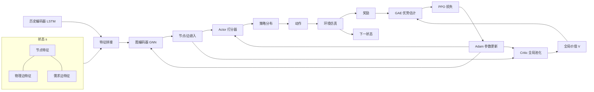

# QKD三层FSO网络强化学习算法介绍（Graph-MAPPO）

> 本文档只描述**算法本身**：问题建模、输入特征、编码方式、动作与价值、奖励、训练与参数更新，全部用数学公式表达，不涉及任何代码实现。所有定义与 `Research/qkd_rl` 当前代码保持一致，术语的唯一来源见 [[QKD三层FSO网络强化学习代码架构设计-精简版]]。

## 0. 算法总览

本文介绍的算法用于求解 QKD 三层网络的密钥分发调度问题。在每个时隙，网络中存在大量可选的物理链路，同时地面站之间不断产生有截止时间的密钥请求；算法需要决定激活哪些链路，使生成的密钥能够沿着中继路径及时服务请求。

算法整体可以概括为一条从“状态感知”到“策略学习”的处理链路：

1. **状态构建**：将当前网络抽象为一张由物理链路和请求边组成的图。物理链路描述“能生成多少密钥、还有多少存储空间”，请求边描述“哪里需要密钥、还剩多少时间”。
2. **需求扩散**：每条请求的压力沿当前可用的物理链路扩散，使每条物理链路获得一个反映其对满足需求重要性的指标。
3. **链路打分与匹配**：Actor 根据链路自身的速率、容量、可用性以及需求重要性为每条合法链路打分，再根据分数选择一组互不冲突的链路作为本时隙动作。
4. **环境交互与奖励**：被激活的链路生成密钥，密钥被存入链路池并用于服务请求；环境根据服务、失败、切换等结果给出奖励。
5. **策略更新**：Critic 评估状态价值，PPO 根据“当前动作是否优于平均水平”更新 Actor 的打分策略，使长期累计奖励不断提高。

这五个环节在每个时隙循环执行，最终目标是学习一个能够最大化长期累计奖励的链路选择策略。

## 1. 问题建模：带图结构的马尔可夫决策过程

### 1.1 场景

三层 FSO 量子密钥分发网络由三类节点构成：地面站（GS）、高空平台（HAP）、卫星（SAT）。任意两层之间以及同层内部存在候选物理链路（GS-HAP、GS-SAT、HAP-SAT、SAT-SAT），每条链路按分钟生成密钥（QKP），生成的密钥可以在链路密钥池中暂存。地面站之间以分钟粒度随机到达通信密钥需求请求，请求有截止时间与优先级。

在每个时隙 $t$（1 分钟），智能体观察全局网络状态，为每个节点决定是否激活某条候选链路（或保持空闲），链路激活后按该时隙速率生成密钥，生成密钥经路由分配去服务待处理的请求。

### 1.2 MDP 五元组

| 元素 | 定义 |
| --- | --- |
| 状态 $s_t$ | 由**物理图**与**逻辑图**融合成的全局图：节点集合 + 物理链路边 + GS-GS 需求边，以及每个实体携带的特征与历史（见 §3） |
| 动作 $a_t$ | 一个**全局匹配**：从当前合法物理边集合中选出一组互不相交的边（每个节点至多参与一条），未匹配节点保持空闲 |
| 转移 $P(s_{t+1}\mid s_t,a_t)$ | 由链路速率的时间演化（天气、轨道几何）、密钥生成/过期、请求到达/服务/过期决定 |
| 奖励 $r_t$ | 见 §6，B1 shaped：服务成功、重要性加权生成、失败/过期与切换惩罚，按固定参考值归一化 |
| 折扣因子 | $\gamma$（默认 $0.99$） |

### 1.3 图的动态性与动作合法性

图随 $t$ **实时更新**：物理图只保留当前合法的链路，逻辑图只保留活跃或近期出现过的请求对。动作掩码在**构图之前**完成——不可用、速率低于下限、被禁用类型的链路直接不出现在任何节点的候选集合中；`idle` 恒合法。因此策略只在合法动作上定义（见 §5.2）。
### 1.4 网络拓扑样例

一个包含三种节点、四种物理链路和 GS-GS 请求链路的示意拓扑（颜色仅用于区分类型）：

| 图元 | 含义 |
| --- | --- |
| 绿色节点 | 地面站 GS |
| 橙色节点 | 高空平台 HAP |
| 蓝色节点 | 卫星 SAT |
| 蓝实线 | 物理链路 GS-HAP |
| 紫实线 | 物理链路 GS-SAT |
| 橙实线 | 物理链路 HAP-SAT |
| 深灰实线 | 物理链路 SAT-SAT |
| 红色虚线 | GS-GS 请求链路（逻辑图，不可被动作选择，只参与 GNN 编码） |

物理图由"三种节点 + 四种物理链路"构成，逻辑图由"地面站之间的请求链路"构成；两者共享同一节点集合，融合为一个全局图。

## 2. 总体架构

算法采用**共享编码器的 Actor-Critic** 结构，属于多智能体 PPO（MAPPO）在单图场景下的等价形式：所有节点共享同一策略参数，Critic 是全局价值函数。

- **编码器**：先由历史编码器（共享 LSTM，可选）把每个实体的历史窗口编码为向量，再与手工特征拼接，最后经图编码器（GNN）消息传递得到每个节点、每条边的嵌入。
- **Actor**：参数在所有边/节点间共享。默认 `demand_edge` 模式直接读取物理边特征（含 relay importance）打分；`mixed` 模式拼接两端节点嵌入与边嵌入打分。再按这些分数**顺序采样一个匹配**（每步只在两端点仍空闲的边中选一条）；确定性评估时按分数贪心选边。
- **Critic**：对节点嵌入和两类边嵌入分别做全局池化，拼上规模计数，输出全局标量价值 $V(s)$。
- **训练**：环境 rollout 收集轨迹 → GAE 计算优势与回报 → PPO 裁剪目标更新共享参数。

## 3. 输入特征

特征由三部分组成：节点特征、物理边特征、需求边特征，以及可选的每个实体的历史序列编码。

### 3.1 节点特征

节点 $v$ 的静态/动态特征向量记为 $x_v \in \mathbb{R}^{d_n}$：

| 特征 | 含义 |
| --- | --- |
| $\mathrm{onehot}(type_v)$ | 节点类型 GS/HAP/SAT 的 one-hot（3 维） |
| $\mathrm{qkp\_level}_v$ | 节点所有关联链路密钥池总库存 / 总容量 |
| $\mathrm{qkp\_cap\_left}_v$ | 关联链路剩余容量 / 总容量 |
| $\mathrm{demand\_in}_v, \mathrm{demand\_out}_v$ | 以 $v$ 为目的/源的请求密钥量（按量级归一化） |
| $\mathrm{queue\_pressure}_v$ | 以 $v$ 为源或目的、仍在等待服务的请求个数（按计数归一化），衡量节点积压压力 |
| $\mathrm{recent\_demand}_v$ | 历史窗口 $[15,60,240]$ 内到达量，每个窗口一个求和值（3 维） |
| $\mathrm{is\_available}_v$ | 是否存在任一可用相邻链路 |
| $\mathrm{qkp\_utilization}_v$ | 关联链路库存利用率（当前实现与 $\mathrm{qkp\_level}$ 数值相同） |
| 时间周期特征 | 分钟/年中的 $\sin/\cos$ 编码 |

### 3.2 物理边特征（前向时间窗）

物理边 $i=(u,v)$ 的特征记为 $e_i^{p} \in \mathbb{R}^{d_p}$：

| 特征 | 含义 |
| --- | --- |
| $\mathrm{onehot}(type_i)$ | 链路类型 one-hot（4 维） |
| $a_i(t)$ | 当前时隙可用性 |
| $\hat{r}_i(t)$ | 当前归一化速率 |
| $\{r_i(t+\tau)\}_{\tau=1}^{H}$ | 未来 $H=6$ 步归一化速率（前向窗口） |
| $\{a_i(t+\tau)\}_{\tau=1}^{H}$ | 未来 $H$ 步可用性 |
| $\Delta r_i$、$\bar r_i$、$\max r_i$ | 窗口内速率增量/均值/最大值 |
| $\mathrm{last\_activated}_i$ | 上一时隙是否激活 |
| $I_i(t)$ | **relay importance**：需求边扩散到该物理边上的重要度，动态 BFS 计算，归一化到 $[0,1]$ |
| $\mathrm{qkp\_cap\_left}_i$ | 链路剩余 QKP 容量 / 容量（未满则仍可继续生成存储） |

未来速率进入特征的原因：离线数据中未来速率已知，智能体可以据此规划"何时激活、何时让链路休息"。

切换标志不作为独立特征：$\mathrm{last\_activated}$ 已给出上一时隙是否激活，配合本时隙自身的激活决策即可推断是否发生切换；切换时隙生成速率减半的语义仍由环境实现（见精简版文档）。

#### 3.2.1 relay importance 的计算（动态 BFS 扩散）

设当前时隙合法可见的物理边构成图 $G_t$，所有有 pending 请求的 GS-GS 对构成需求边集合。对每个请求对 $(p,q)$，定义其剩余需求为

$$
B_{pq}(t)=\sum_{\text{req}\in(p,q)}\max(0,\ \text{amount}-\text{served}),
$$

当前配置 $K=3$（`max_path_links`），即一条物理边要成为该请求对的候选，两端地面站经过它连通的**总跳数**不超过 $K$。对边 $i=(u,v)$，令

$$
a=\min(d(p,u),d(p,v)),\qquad b=\min(d(q,u),d(q,v)),
$$

其中 $d(\cdot,\cdot)$ 是**在 $G_t$ 上**的 BFS 最短跳数，因此不可见的链路不会参与扩散。若 $a,b$ 均连通且 $a+b+1\le K$，则该请求对向边 $i$ 累积：

$$
\mathrm{relay}_i \mathrel{+}= B_{pq}(t)\cdot \eta^{\max(0,\,a+b-1)}\cdot \mathrm{cap\_left}_i,
$$

其中 $\eta=0.25$ 是跳数衰减，$\mathrm{cap\_left}_i$ 是链路剩余容量比例。最后按本步最大值归一化：

$$
I_i(t)=\frac{\mathrm{relay}_i}{\max_j \mathrm{relay}_j}\in[0,1].
$$

这一步把所有请求对的压力压成**每条物理边一个标量**，Actor 不需要自己学“哪些边能组成路径”，只需要学“重要性高的边是否值得选”。

### 3.3 需求边特征（等待分桶）

GS-GS 需求边 $j=(p,q)$ 的特征记为 $d_j \in \mathbb{R}^{d_d}$：

| 特征 | 含义 |
| --- | --- |
| $\mathrm{pending\_amount}_j$ | 该请求对 pending 密钥量（归一化） |
| $\mathrm{pending\_count}_j$ | pending 请求数（归一化） |
| $\mathrm{min\_deadline}_j$、$\mathrm{mean\_deadline}_j$ | 剩余截止时间的最小/均值（归一化） |
| $\mathrm{mean\_wait}_j$ | 平均已等待时间（归一化） |
| $\mathrm{priority\_sum}_j$ | 请求量 × 优先级之和（归一化） |
| $\{W_{j}^{(k)}\}_{k=1}^{10}$ | 剩余需求按“已等待时间”分桶，每个桶一个剩余量（10 维，`wait_bucket_count=10`） |

等待分桶把截止时间长度均匀切成 10 个桶，桶内记录的是**该等待时长区间内仍剩余的需求量**。这样 Actor/Critic 不仅知道“有多少需求”，还知道“需求已经等了多久、还差多久到期”，为 relay importance 的紧迫度判断提供时间维度。当前 `wait_decay_tau=0`，即暂时不按等待时间做指数衰减，剩余量直接求和。

### 3.4 历史编码器（共享 per-entity LSTM，可选）

每个节点、每条物理链路、每条需求链路各自维护长度为 $L$ 的历史序列（冷启动时左侧补零，用有效长度 $l$ 表示）。三类实体的通道数不同，因此先各自用输入投影 $\mathrm{Proj}^{type}$ 统一到隐藏维，再送入**同一套共享 LSTM**：

$$
h_v^{\mathrm{hist}} = \mathrm{LSTM}\big(\mathrm{Proj}^{node}([\,x_v^{(t-L+1)};\dots;x_v^{(t)}\,])\big)_{\text{最后一步}},\quad h_i^{\mathrm{hist}} \text{ 同理}.
$$

- 节点序列通道：当步到达/服务/失败量、关联链路密钥池总量；
- 物理边序列通道：QKP 水平、可用性、激活标志；
- 需求边序列通道：到达/服务/失败量。

设计原则：**LSTM 只编码过去**（未来速率只走前向窗口特征），参数在 actor 与 critic 之间共享，输出为每个实体的向量 $h\in\mathbb{R}^{d_H}$。

### 3.5 特征拼接（进入 GNN 之前）

历史编码器启用后，手工特征与 LSTM 输出拼接（未启用时 $h=\mathbf 0$）：

$$
\tilde x_v = [\,x_v\;;\; h_v^{\mathrm{hist}}\,],\qquad
\tilde e_i = [\,e_i^p \;;\; \mathbf 0 \;;\; h_i^{\mathrm{hist}}\,],\qquad
\tilde d_j = [\,\mathbf 0 \;;\; d_j \;;\; h_j^{\mathrm{hist}}\,].
$$

物理边在需求特征部分补 0、需求边在物理特征部分补 0，统一到同一特征维度 $d_e = d_p + d_d$（未启用历史编码器时为 $d_e=d_p+d_d$）。所有特征在送入网络前按配置做了归一化。

## 4. 图编码器（GNN）

### 4.1 投影

先对拼接后的特征做线性/MLP 投影到隐藏维 $d$：

$$
h_v^{(0)} = \sigma\big(W_n \tilde x_v + b_n\big),\qquad
e_i^{(0)} = \sigma\big(W_e \tilde e_i + b_e\big),
$$

物理边与需求边使用**各自独立的边投影**：虽然两类边特征已统一到同一维度，但语义不同（链路能力 vs 请求压力），投影阶段就不共享变换；投影后仍处于同一 hidden 空间，便于后续统一的消息聚合。

### 4.2 边条件消息传递

设第 $k$ 层的节点嵌入为 $h_v^{(k)}$，边嵌入固定为 $e_i^{(0)}$（只在入口投影一次）。两类边各用独立的 message MLP $\varphi^p, \varphi^d$：

$$
m_i^{(k)} = \varphi^{type(i)}\Big(\big[\,h_{s(i)}^{(k)}\;;\; e_i^{(0)}\,\big]\Big),
$$

其中 $s(i)$ 是边的起点（有向化后每条无向链路对应两条有向边）。按终点聚合：

$$
a_v^{(k)} = \frac{1}{|\mathcal{N}_v^{d}|}\sum_{i\in\mathcal{N}_v^{d}} m_i^{(k)}.
$$

**当前默认 `demand_edge` 模式只让需求边更新节点**：物理边的能力信息不进入节点消息，而是通过 §3.2.1 的 relay importance 预先压进物理边特征，再由 Actor 直接读取。这样避免“高速率但与需求无关的链路”污染节点状态，也避免重要性被 GNN 多层平均稀释。

`mixed` 模式（保留作对比）则两类边都参与消息传递，物理边与需求边**各自按自己的入边邻居数取平均再相加**：

$$
a_v^{(k)} =
\frac{1}{|\mathcal{N}_v^{p}|}\sum_{i\in\mathcal{N}_v^{p}} m_i^{(k)}
\;+\;
\frac{1}{|\mathcal{N}_v^{d}|}\sum_{i\in\mathcal{N}_v^{d}} m_i^{(k)},
$$

$\mathcal{N}_v^{p}$、$\mathcal{N}_v^{d}$ 分别为以 $v$ 为终点的物理边、需求边集合（孤立节点聚合结果为 $\mathbf 0$）。

### 4.3 更新、归一化与残差

$$
\tilde h_v^{(k+1)} = \mathrm{LayerNorm}\Big( U^{(k)}\big(\,[\,h_v^{(k)}\;;\; a_v^{(k)}\,]\,\big) \Big),
\qquad
h_v^{(k+1)} = h_v^{(k)} + \tilde h_v^{(k+1)} \;\text{（残差，可配置）}.
$$

共 $K=3$ 层。输出为节点嵌入矩阵 $H \in \mathbb{R}^{|V|\times d}$ 与边嵌入矩阵 $E \in \mathbb{R}^{|E|\times d}$。在默认 `demand_edge` 模式下，节点嵌入主要携带需求压力，物理边打分所需的链路能力与 relay importance 直接来自边特征；边嵌入在 GNN 中不做逐层更新，保持与输入特征的一一对应。

## 5. Actor 与 Critic

### 5.1 Actor：边级打分

所有物理边共享同一打分器。**默认 `demand_edge` 模式**对每条合法物理边 $(u,v)$ 打分：

$$
s_{(u,v)} = \mathrm{MLP}^{edge}\big(e_{(u,v)}\big),
$$

其中 $e_{(u,v)}$ 是物理边经过投影后的边嵌入，包含速率、剩余容量、可用性和 relay importance。这样设计的原因是：**决策最终落在链路上**，而需求如何影响链路已经被 relay importance 显式算好了，Actor 只需学会“重要性高且速率/容量合适的边值得选”。

`mixed` 模式使用拼接后的节点与边嵌入：

$$
s_{(u,v)} = \mathrm{MLP}^{edge}\big(\,[\,h_u\;;\; h_v\;;\; e_{(u,v)}\,]\,\big),
$$

其中 $h_u,h_v$ 是 GNN 输出的两端节点嵌入。两种模式下同一条边两端共享同一个分数，因此分数在全图范围内可比。

### 5.2 Mask 与全局匹配策略

mask 在构图前完成：不可用、低速率、禁用类型的链路不进入任何候选，因此打分只发生在合法边上。策略通过**顺序采样**生成一个匹配：

$$
\pi_\theta(\mathcal{M}\mid s_t) = \prod_{k=1}^{|\mathcal{M}|} \frac{\exp\big(s_{e_k}/T\big)}{\sum_{e\in\mathcal{A}_k}\exp\big(s_e/T\big)},
$$

其中 $e_k$ 是第 $k$ 步选中的边，$\mathcal{A}_k$ 是第 $k$ 步两端点仍空闲的合法边集合，$T$ 为温度（默认 $1.0$）。采样时对 $\mathcal{A}_k$ 做 softmax 取一条；确定性评估时取 argmax。联合对数概率为每一步 softmax 对数概率之和，PPO 优化的正是环境实际执行的那个匹配。

### 5.3 Critic：全局价值

Critic 采用分类型全局池化（`typed_mean`）。三类嵌入分别取平均：

$$
g_{\mathrm{node}} = \frac{1}{|V|}\sum_{v\in V} h_v,\qquad
g_{\mathrm{phys}} = \frac{1}{|E_p|}\sum_{i\in E_p} e_i,\qquad
g_{\mathrm{demand}} = \frac{1}{|E_d|}\sum_{j\in E_d} e_j,
$$

拼上压缩后的图规模计数：

$$
g = \Big[\,g_{\mathrm{node}}\;;\; g_{\mathrm{phys}}\;;\; g_{\mathrm{demand}}\;;\;
\log(1+|V|)\;;\; \log(1+|E_p|/2)\;;\; \log(1+|E_d|/2)\,\Big] \in \mathbb{R}^{3d+3},
$$

最终 $V_\psi(s_t) = \mathrm{MLP}^{critic}(g)$。分类型池化避免物理边与需求边在池化时相互稀释，计数项弥补均值池化丢失的图规模信息。由于每个时隙只有**一个**全局价值，所有节点共享同一优势。

## 6. 奖励设计

当前默认奖励为 **B1 shaped 稠密流式奖励**，分为供应侧（生成密钥）与需求侧（服务质量）两部分：

$$
r_t = \underbrace{\frac{w_s\,S_t}{R_{\mathrm{served}}}}_{\text{服务成功}}
\;+\;\underbrace{\frac{w_g}{R_{\mathrm{dense}}}\sum_{i\in\mathcal{M}_t} \mathrm{added}_i\cdot I_i}_{\text{重要性加权生成}}
\;-\;\underbrace{\frac{w_f\,F_t + w_e\,E_t}{R_{\mathrm{served}}}}_{\text{失败/过期}}
\;-\;\underbrace{w_c\,C_t}_{\text{切换惩罚}},
$$

| 分量 | 含义 | 默认权重 |
| --- | --- | --- |
| $S_t$ | 本步成功服务的密钥量 | $w_s=5.0$ |
| $\mathrm{added}_i\cdot I_i$ | 物理边 $i$ 实际存入 QKP 池的密钥量 × relay importance | $w_g=0.001$，$R_{\mathrm{dense}}=10^6$ |
| $F_t$ | 失败密钥量（含过期请求） | $w_f=0.01$ |
| $E_t$ | 过期密钥量 | $w_e=0.01$ |
| $C_t$ | 切换链路条数（当前激活但上一时隙未激活） | $w_c=0.001$ |
| $R_{\mathrm{served}}$ | 固定需求参考值 `served_reference=100000` | — |

需求侧分量统一除以**固定的** $R_{\mathrm{served}}$，不再使用滑动到达均值。固定参考值保证“同样 1 bit 服务量”在开局、深夜、高峰时期获得相同的奖励尺度，避免奖励在 episode 内部随时间漂移。

供应侧 dense 项只奖励“生成在重要中继路径上且实际存入池中”的密钥，权重较小，主要作为每步都非零的稠密信号；生成但溢出、或生成在低重要性链路上的密钥不获得奖励。切换惩罚是链路切换计数，按自身 $O(1)$ 权重计算，不再除以百万级参考值。

诊断用 `baseline_score` 奖励模式（可选）：直接令

$$
r_t=\sum_{i\in\mathcal{M}_t}\big(w_r\cdot \hat r_i + w_I\cdot I_i\big),
$$

即奖励就是动态 BFS 基线对所选边打的分数，用于隔离“奖励设计问题”与“策略/特征问题”。

## 7. 训练（MAPPO / PPO）

### 7.1 Rollout 收集

策略 $\pi_\theta$ 与环境交互 $T$ 步（$T$ 由训练配置 `rollout_steps` 决定），每步记录观测 $s_t$、动作（匹配）$a_t$、旧策略联合对数概率 $\log\pi_{\theta_{\mathrm{old}}}(a_t\mid s_t)$、价值 $V_\psi(s_t)$、奖励 $r_t$、终止标志 $d_t$，存入 rollout buffer。

支持**连续训练**、**课程训练**与**固定日训练**：连续训练从激活窗口内随机起点开始，之后按时间顺序不 reset 地继续；课程先用短局频繁更新，再逐步加长到 1440 步（`--mode curriculum`）；固定日则每个 episode 从 $t=0$ 开始跑满 1440 步（`--mode fixed_day`）。训练模式统一在 `configs/train_profiles.yaml` 中配置。

### 7.2 GAE 优势估计

$$
\delta_t = r_t + \gamma\,(1-d_t)\,V_\psi(s_{t+1}) - V_\psi(s_t),
$$

$$
A_t = \delta_t + \gamma\lambda\,(1-d_t)\,A_{t+1},
$$

回报（TD 目标）为 $\hat R_t = A_t + V_\psi(s_t)$。默认 $\gamma=0.99$，$\lambda=0.95$。

### 7.3 PPO 目标

每个 minibatch 内先将优势标准化：

$$
\bar A = \frac{A - \mu_A}{\sigma_A + 10^{-6}}.
$$

重要性采样比率

$$
\rho_t(a_t\mid s_t) = \exp\big(\log\pi_\theta(a_t\mid s_t) - \log\pi_{\theta_{\mathrm{old}}}(a_t\mid s_t)\big),
$$

裁剪的 surrogate 目标：

$$
\mathcal{L}^{\mathrm{clip}}(\theta) =
-\frac{1}{N}\sum_{t}\min\Big(\rho_t \bar A_t,\; \mathrm{clip}(\rho_t,\,1-\epsilon,\,1+\epsilon)\,\bar A_t\Big),
$$

$\epsilon=0.2$。Critic 损失为均方误差：

$$
\mathcal{L}^{\mathrm{value}}(\psi) = \frac{1}{N}\sum_t \big(V_\psi(s_t) - \hat R_t\big)^2.
$$

总损失加入熵正则：

$$
\mathcal{L} = \mathcal{L}^{\mathrm{clip}} + w_v\,\mathcal{L}^{\mathrm{value}} - w_e\,\mathbb{E}[\mathcal{H}(\pi_\theta(\cdot\mid s_t))],
$$

默认 $w_v=0.5$，$w_e=0.001$（熵使用全局匹配的 per-decision 平均熵，因此系数保持较小）。

### 7.4 参数更新流程

每个 update 的流程：

1. **Rollout**：用当前策略收集 $T \times$ episode 数 的轨迹（动作采样、价值评估均为 $no\_grad$）。
2. **GAE**：从后向前计算 $\{A_t\},\{\hat R_t\}$。
3. **多轮 minibatch 优化**：将轨迹打乱分成 minibatch（固定日配置默认 256，课程配置默认 512），对每个 minibatch：
   - 重算 $\log\pi_\theta$、熵与 $V_\psi$（块对角批量前向）；
   - 计算 $\mathcal{L}$，反向传播；
   - 梯度裁剪：$\|g\|_2 \le 0.5$；
   - Adam 更新。
4. **早停**：若 minibatch 的平均 KL 散度 $\frac{1}{N}\sum(\rho_t - 1 - \Delta\log\pi_t) > 0.03$，提前结束本轮 epoch。
5. **记录与保存**：输出 actor/critic loss、熵、KL、平均奖励、成功率等指标，定期保存 checkpoint（含模型、优化器状态、update 计数），支持断点续训。

优化器采用 Adam，**编码器与 Actor 使用学习率 $3\times10^{-4}$，Critic 使用 $10^{-3}$**（Critic 收敛通常需要更大步长）；同一模型内共享的 encoder 参数按 Actor 的学习率更新。当前固定日/课程配置每轮更新 $E=1$ 个 epoch。

## 8. 关键超参数汇总

| 参数 | 默认值 | 含义 |
| --- | --- | --- |
| 隐藏维 $d$ | 128 | GNN/打分器隐藏维 |
| GNN 层数 $K$ | 3 | 消息传递层数 |
| 未来窗口 $H$ | 6 | 物理边前向速率/可用性窗口 |
| 需求等待分桶 | 10 | 需求边 `wait_bucket_count` |
| 节点近期需求窗口 | [15,60,240] | 节点 recent demand 后向统计窗口 |
| LSTM 序列长 $L$ | 240 | 历史编码器窗口（默认关闭） |
| $\gamma$ | 0.99 | 折扣因子 |
| $\lambda$ | 0.95 | GAE 平滑系数 |
| $\epsilon$ | 0.2 | PPO 裁剪幅度 |
| $w_v$ / $w_e$ | 0.5 / 0.001 | 价值系数 / 熵系数 |
| $R_{\mathrm{served}}$ | 100000 | shaped reward 固定需求参考值 |
| 梯度范数上限 | 0.5 | 梯度裁剪 |
| target KL | 0.03 | 早停阈值 |
| 学习率 | 3e-4 / 1e-3 | Actor(含encoder) / Critic |
| minibatch | 256 / 512 | 固定日 / 课程配置默认 |
| PPO epochs | 1 | 当前固定日/课程配置默认 |

> 说明：所有"优化速度/实现"层面的改动（向量化、批量前向、零拷贝等）都不改变上述任何数学定义，本文档描述的算法与代码语义严格一致。
